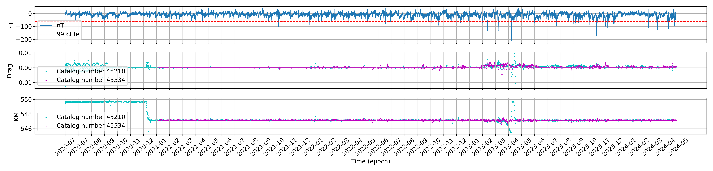
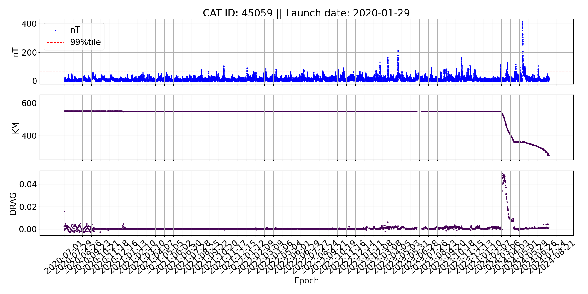
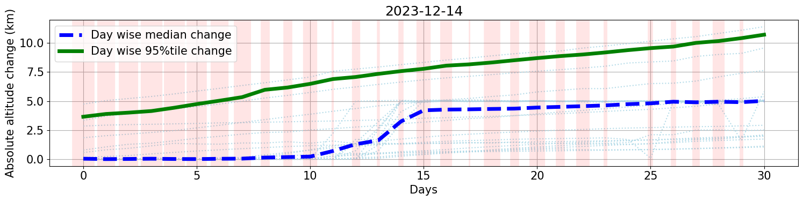
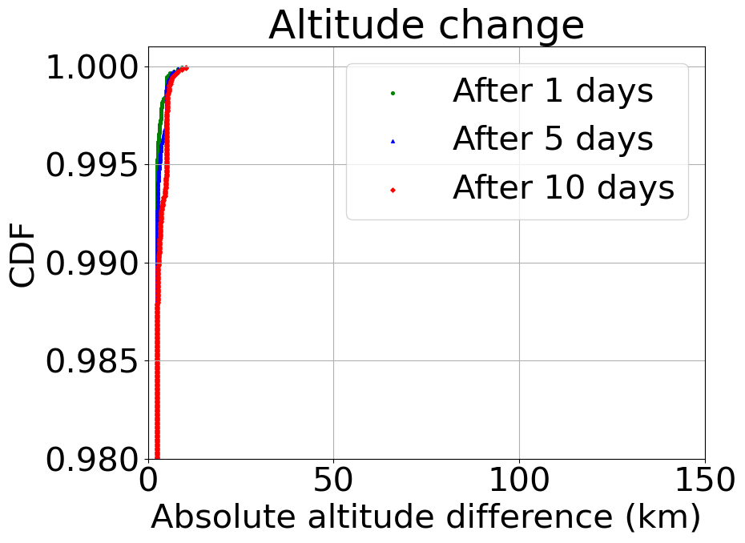
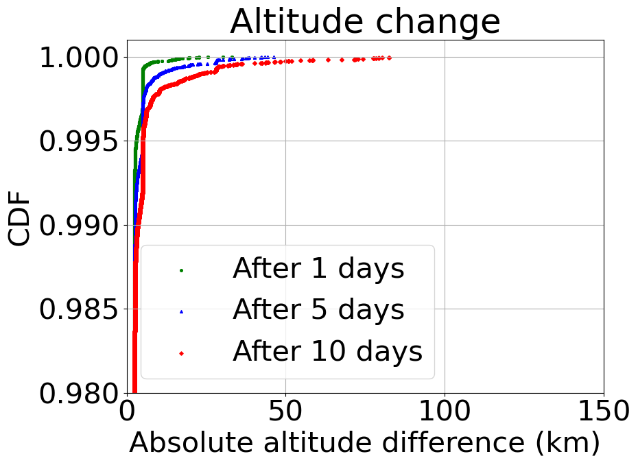

# Cosmic Dance - Measuring Orbital Shifts

A tool designed to analyze the impact of solar radiation on spaceborne infrastructure, particularly in Low Earth Orbit (LEO). By leveraging data from large-scale deployments like SpaceX’s Starlink, **CosmicDance** provides insights into satellite orbital shifts and identifies risks such as premature orbital decay.


# Table of Contents
- [Getting started](#Getting-started)
    - [Setting up](#setting-up)
    - [Measure orbital shifts](#measure-orbital-shifts)
        - [Acquire dataset](#acquire-dataset)
        - [Pre-process the dataset](#pre-process-the-dataset)
        - [Timeseries](#timeseries)
        - [Type of orbital shifts](#type-of-orbital-shifts)
        - [Maximum altitude change](#maximum-altitude-change)
        - [Measuring Solar Superstorm of May 2024](#measuring-solar-superstorm-of-may-2024)
        - [Analysis of a few other satellites](#analysis-of-a-few-other-satellites)
- [License](#license)
- [Cite this work](#cite-this-work)
- [Credits](#credits)


# Getting started

**CosmicDance** is a modular framework that utilizes multimodal datasets, including solar activity intensity and satellite tracking data. It maps these datasets in a time series to measure and visualize how orbital trajectories change at scale.

<p align="center">

</p>

## Setting up
Use the following steps to build **CosmicDance** environment.

- Install dependencies

```bash
sudo apt install curl
```

- Create conda environment from `environment.yml`

```bash
conda env create -f dependencies/environment.yml
```

For macOS use `environment_macOS.yml`

```bash
conda env create -f dependencies/environment_macOS.yml
```

- Activate `cosmicdance` environment

```bash
conda deactivate && conda activate cosmicdance
```

- Add user credentials for [space-track](https://www.space-track.org/auth/createAccount) in [credentials/credentials_0.json](/credentials/credentials_0.json)

```json
{
    "ID": "user@domain.com",
    "PWD": "password"
}
```

- Export `CosmicDance` path in the shell. This will allow seamless execution of scripts.

```bash
export PYTHONPATH=`COSMIC_DANCE_PATH`
```

## Measure orbital shifts

**CosmicDance** processes datasets in parallel by default. However, for each script, you can set `PARALLEL_MODE` to `False` to run the processing in serial mode.

> **Note:** macOS users may encounter issues with parallel mode. It is recommended to set `PARALLEL_MODE` to `False` in such cases.

```python
PARALLEL_MODE = False
```

### Acquire dataset

**CosmicDance** automatically acquires solar activity data (Dst index) from the [World Data Center for Geomagnetism](https://wdc.kugi.kyoto-u.ac.jp/index.html), Kyoto, NORAD Catalogue Numbers from [CelesTrak](https://celestrak.org), and TLEs from [Space-Track](https://www.space-track.org/auth/login) through the following steps.


- Get Dst index
```bash
python starlink/build_dataset/acquire/Dst_index.py
```
- Get satellite NORAD Catalog Number
```bash
python starlink/build_dataset/acquire/new_catalog_numbers.py
```
- Download TLEs 
```bash
python starlink/build_dataset/acquire/download_historic_tles.py
```

### Pre-process the dataset

Prepare the dataset for orbital shift analysis by following these steps:


#### Dst Index

Prepare the time window (start and end timestamps) of solar activities above or below a certain intensity by following these steps:

- Solar storm times according to [NOAA Space Weather Scales](https://www.swpc.noaa.gov/noaa-scales-explanations)

```bash
python starlink/build_dataset/preprocess/DST/timespan_NOAA.py
```

- Solar activities above some percentile

```bash
python starlink/build_dataset/preprocess/DST/timespan_percentile.py
```

- Quiet time below some percentile

```bash
python starlink/build_dataset/preprocess/DST/timespan_quiet_day.py
```


#### TLEs

Preprocess the TLEs by removing erroneous values and filtering out Starlink orbit-raising operations from the staging orbit after launch through the following steps:

- Convert TLEs from `JSON` to `CSV`

```bash
python starlink/build_dataset/preprocess/TLEs/JSON_to_CSV.py
```

- Cleanup the TLEs

```bash
python starlink/build_dataset/preprocess/TLEs/cleanup.py
```

- Remove TLEs before orbit raise (Starlink)

```bash
python starlink/build_dataset/preprocess/TLEs/remove_orbit_raise_maneuver.py
```

### Timeseries

The following steps map the multimodal datasets (solar activity and satellite orbital parameters) into a single time series using timestamps and identify abrupt changes in trajectory closely following a solar event:

- Generate launch date (or satellite) wise time series plot of orbital parameters with intensity of solar activities

```bash
python starlink/timeseries/view_timeseries_with_dst.py
```

- The satellite (NORAD catalog number 45059) experienced an altitude drop of approximately 100 km immediately following a high-intensity solar activity and also notice an increased decay rate after the solar superstorm of May'24. For additional time series plots, refer to the [notebook](/starlink/timeseries/timeseries_view.ipynb) and the output directory of `view_timeseries_with_dst.py`.

<p align="center">

</p>


### Type of orbital shifts

Measure the satellite orbital changes, specifically altitude, within high and low solar activity windows in a time series by following these steps:

- Orbital shifts after quiet day

Set relevant input output files using `OUTPUT_DIR` and `EVENT_DATES_CSV`

```python
OUTPUT_DIR = "artifacts/OUTPUT/Starlink/measurement/track_altitude_change/quiet_day"
EVENT_DATES_CSV = "artifacts/OUTPUT/Starlink/timespans/quiet_day/below_ptile_80.csv"
DAYS = 15
```

Execute the measurement script

```bash
python starlink/orbital_shifts/trace_altitude.py
```

- Orbital shifts after high solar activity day

Set relevant input output files using `OUTPUT_DIR` and `EVENT_DATES_CSV`

```python
OUTPUT_DIR = "artifacts/OUTPUT/Starlink/measurement/track_altitude_change/merged_above_ptile_99/RAW"
EVENT_DATES_CSV = "artifacts/OUTPUT/Starlink/timespans/percentile/merged_above_ptile_99.csv"
DAYS = 30
```

Execute the measurement script

```bash
python starlink/orbital_shifts/trace_altitude.py
```

- Segregate the type of shifts

```bash
python starlink/orbital_shifts/detect_altitude_shifts.py
```

- Light sky-blue dotted lines represent the altitude changes of individual satellites. The thickness of the vertical red bars indicates the relative solar activity intensity compared to the first day. The thick green and dashed blue lines depict the 95th percentile and median altitude changes observed on that day, respectively. For more observations, refer to the [notebook](/starlink/orbital_shifts/view_altitude_shift.ipynb).


<p align="center">

</p>


### Maximum altitude change

Measure the impact of solar event intensity and duration on orbital changes, specifically altitude, by following these steps:

#### For intensity

- After low intensity solar activity days

Set relevant input output files using `OUTPUT_DIR`, `OUTPUT_CSV`, and `DST_TIMESPAN`

```python
OUTPUT_DIR = "artifacts/OUTPUT/Starlink/measurement/maximum_altitude_change"
OUTPUT_CSV = f"{OUTPUT_DIR}/quiet_day_after_1_5_10.csv"
DST_TIMESPAN = "artifacts/OUTPUT/Starlink/timespans/quiet_day/merged_below_ptile_80.csv"
```

Execute the measurement script

```bash
python starlink/altitude_change/for_intensity.py
```

- After high intensity solar activity days

Set relevant input output files using `OUTPUT_DIR`, `OUTPUT_CSV`, and `DST_TIMESPAN`

```python
OUTPUT_DIR = "artifacts/OUTPUT/Starlink/measurement/maximum_altitude_change"
OUTPUT_CSV = f"{OUTPUT_DIR}/event_day_after_1_5_10.csv"
DST_TIMESPAN = "artifacts/OUTPUT/Starlink/timespans/percentile/merged_above_ptile_95.csv"
```

Execute the measurement script

```bash
python starlink/altitude_change/for_intensity.py
```


#### For duration

- Short duration events

Set relevant input output files using `OUTPUT_DIR`, `OUTPUT_CSV`, and `df_timespan`

```python
OUTPUT_DIR = "artifacts/OUTPUT/Starlink/measurement/maximum_altitude_change"
OUTPUT_CSV = f"{OUTPUT_DIR}/below_H9.csv"
df_timespan = df_timespan[df_timespan[DST.DURATION_HOURS] < 9]
```

Execute the measurement script

```bash
python starlink/altitude_change/for_duration.py
```


- Long duration events

Set relevant input output files using `OUTPUT_DIR`, `OUTPUT_CSV`, and `df_timespan`

```python
OUTPUT_DIR = "artifacts/OUTPUT/Starlink/measurement/maximum_altitude_change"
OUTPUT_CSV = f"{OUTPUT_DIR}/above_H9.csv"
df_timespan = df_timespan[df_timespan[DST.DURATION_HOURS] > 9]
```

Execute the measurement script

```bash
python starlink/altitude_change/for_duration.py
```

- Compare the distribution of altitude change and drag during low and high solar intensity periods. For detailed analysis, see the [notebook](/starlink/altitude_change/view_change_distribution.ipynb).

<p align="center">

&nbsp;&nbsp;&nbsp;&nbsp;

</p>


### Measuring Solar Superstorm of May 2024

Solar events can cause satellite anomalies, tracking errors, and increased drag for satellites in Low Earth Orbit (LEO). Measure the satellite tracking and drag information as follows:

- Check for tracking anomaly

```bash
python starlink/superstorm/tracking_anomaly.py
```

- Check for drag anomaly

```bash
python starlink/superstorm/drag_anomaly.py
```

- Look for anomalies in [notebook](/starlink/timeseries/timeseries_view.ipynb)

### Analysis of a few other satellites

**CosmicDance** can be used for any satellites out of the box by following these steps:

- [HawkEye_360](/HawkEye_360/)
- [ISRO](/ISRO/)


# License
This work is licensed under the [MIT License](/LICENSE).


# Cite this work

## Plain text

```
Basak, Suvam, et al. "CosmicDance: Measuring Low Earth Orbital Shifts Due to Solar Radiations" Proceedings of the ACM Internet Measurement conference. 2024.
```

## BibTeX

```bibtex
@inproceedings {CosmicDance,
    author = {Basak, Suvam and Pal, Amitangshu and Bhattacherjee, Debopam},
    title = {CosmicDance: Measuring Low Earth Orbital Shifts Due to Solar Radiations},
    booktitle = {{ACM IMC}},
    year = {2024},
    doi = {10.1145/3646547.3689024}
}
```


# Credits

Contributors whose support and expertise have been invaluable in the development of **CosmicDance**:

- [**Amitangshu Pal**](https://www.cse.iitk.ac.in/users/amitangshu/)
- [**Debopam Bhattacherjee**](https://bdebopam.github.io)

